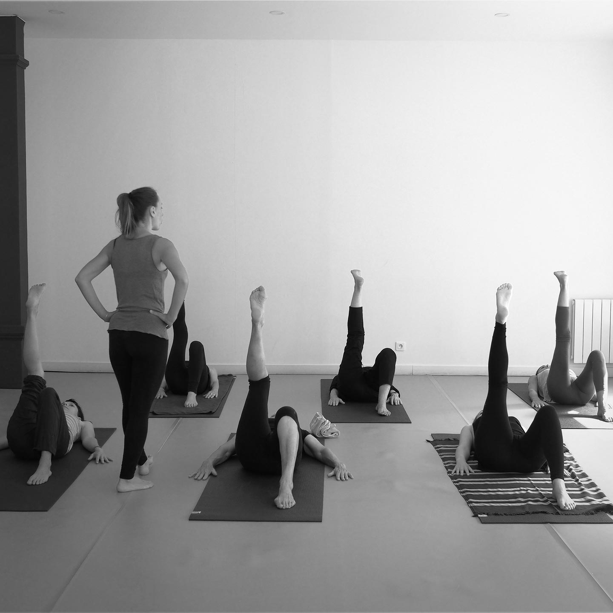
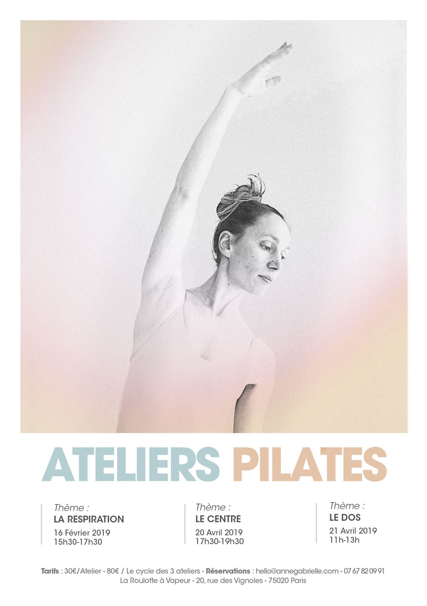
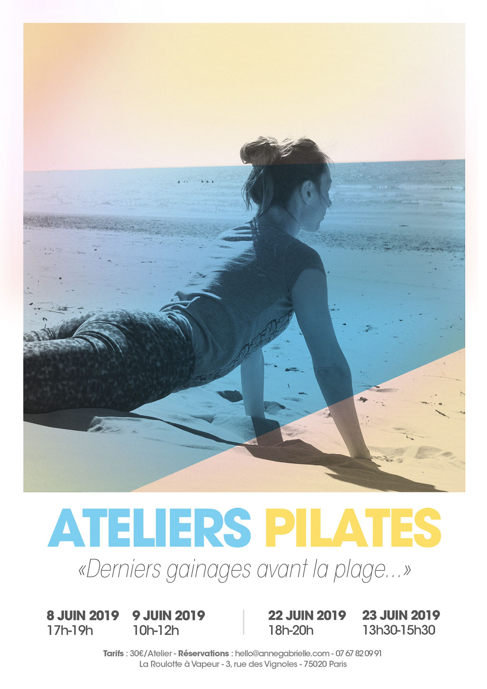

::: full

:::

# Ateliers ponctuels

J’aime proposer des temps de pratique plus longs que le classique cours d’une heure.

J’y vois plusieurs intérêts :

- prendre du temps pour comprendre le fonctionnement du corps,
- permettre à des personnes qui ne pratiquent pas de manière hebdomadaire d’effectuer un travail précis et intense qui infuse dans la tête et le corps et produit les effets d’un merveilleux voyage à l’intérieur de soi
- proposer des ateliers sur des thèmes spécifiques pour des publics spécifiques (ateliers pour femmes enceintes, ateliers prévention des chutes pour les personnes âgées, atelier organisé pour un enterrement de vie de jeune fille...),
- faire interagir le pilates avec d’autres pratiques que j’affectionne (pilates et yoga, pilates et méditation, pilates et randonnée, pilates et alimentation...)
- proposer des ateliers ailleurs que dans mon port d’attache !

### Mes prochains ateliers

Pour qui ? Tout le monde ! Que vous ayez déjà pratiqué le pilates ou non, quelque soit votre niveau.
Pourquoi ? Tonifier ses abdominaux profonds, chouchouter son plancher pelvien, délier sa colonne vertébrale... Pour se sentir mieux, se sentir bien !

<Button-link href="mailto:pilates@anne-gabrielle.com?&body=Bonjour, je souhaite recevoir les informations sur les prochains ateliers en ligne ou en présentiel.">Connaître les prochaines dates…</Button-link>

### Les ateliers précédents

  

    <h4>Ateliers mensuels 2019</h4>
    
  

  

    <h4>Atelier du 19 juin 2019</h4>
    
  

  

    <h4>Atelier du 19 juin 2019</h4>
    
  

  

    <h4>Atelier du 19 juin 2019</h4>
    
  

