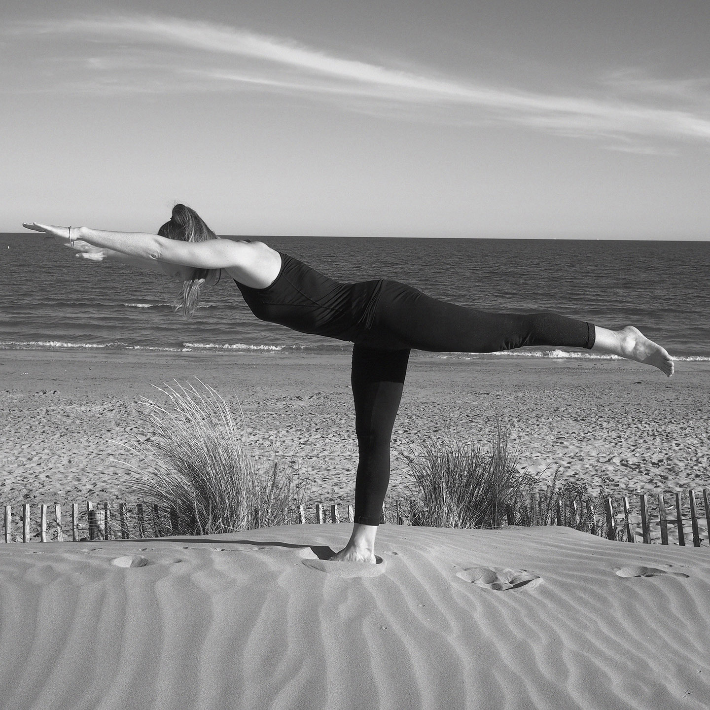

::: full

:::

# Bienfaits du pilates

### Le pilates est une technique douce de renforcement des muscles profonds. Le corps et l’esprit travaillent ensemble pour effectuer des mouvements précis en conscience basés sur une respiration spécifique : la respiration latérale thoracique.

> La pratique du pilates procure de nombreux bienfaits physiques et psychiques.

## Renforcement musculaire global et équilibré

Dans chaque exercice, le corps entier est sollicité. Au fur et à mesure des séances, le schéma corporel devient plus clair, ce qui permet de sortir de certains automatismes et de travailler avec des muscles dont on ignorait jusque là l'existence. Il en résulte un développement de la musculature harmonieux, la diminution des tensions et des douleurs chroniques.

Le _Centre_ (abdominaux et les lombaires) est particulièrement tonifié, c’est le centre d'énergie à partir duquel le corps peut se mouvoir librement. Le renforcement de la sangle abdominale affine la taille et soulage les maux de dos.

## Souplesse

Les étirements font partie intégrante de la méthode. De plus, le travail de mobilité articulaire ainsi que le relâchement des muscles superficiels grâce au renforcement des muscles profonds permettent d'améliorer la souplesse et regagner ou augmenter petit à petit l'amplitude et la fluidité des mouvements.

## Posture

Notre mode de vie au quotidien (la sédentarité au travail, dans les transports, dans le canapé, un travail qui implique une posture debout ou asymétrique prolongée, porter un enfant, un sac, courber le dos et la nuque pour regarder son ordinateur, son téléphone etc...) entraîne des déséquilibres posturaux, des raideurs et douleurs chroniques dans différentes partie du corps (le dos, le cou, les épaules, les hanches…) La méthode pilates permet de délier et réaligner le corps en douceur. La silhouette se redresse et s'allonge. Retrouver son axe est une sensation puissante qui a des effets positifs sur l'humeur et la confiance en soi. 

## Coordination, proprioception et concentration

Les exercices requièrent une grande concentration car ils sont principalement guidés à la voix. Chacun se réapproprie son corps et retrouve une plus juste perception de ses membres dans l'espace et des possibilités de mouvements. La propioception et la coordination contribuent à retrouver un meilleur équilibre.

## Respiration et réduction du stress

La respiration latérale thoracique du pilates décuple les capacités respiratoires. Elle est le prémice de chaque mouvement. Focaliser sur la respiration permet également de se centrer sur le moment présent.

Une bonne oxygénation est un processus à la fois énergisant et déstressant.

> Toute personne qui enclenche les bases du pilates améliore ses fonctionnalités corporelles, mentales et émotionnelles. Ces bénéfices ont un effet direct sur la confiance en soi au quotidien !