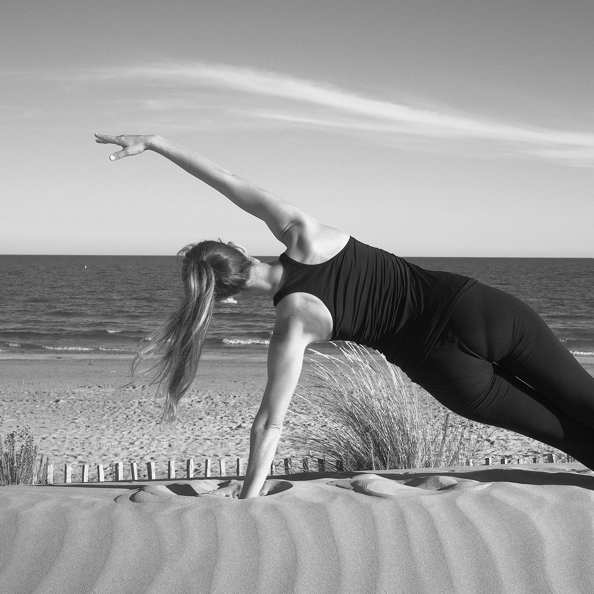

En raison de la crise sanitaire, les cours collectifs en salle sont suspendus. Pour maintenir ou commencer la pratique du pilates, <a href="mailto:pilates@anne-gabrielle.com?&body=Bonjour, je souhaite organiser un cours en ligne" class="color-bg underline">contactez moi</a> pour organiser des cours en ligne ou des cours privés.
{.p .bg-highlight .color-bg .bold .h-full}

::: full

:::

# Horaires, lieux et tarifs

## Cours collectifs du lundi au mercredi

###### Tarifs

- **forfait 10 cours** : 150€ 
- **cours à l'unité** : 18€
- **cours d'essai** : 10€

### Korps, pole santé pluridisciplinaire

##### [📍55b rue Saint Cléophas, 34070 Montpellier](https://goo.gl/maps/hgePCNi5F2J1dAo36)

###### Horaires

- **lundi** : 8h30, 13h, 20h
- **mardi** : 8h30, 13h, 20h

<Button-link href="sms:‭+33767820991?&body=Bonjour, je souhaite reserver pour le cours de pilates jour: , heure: . Merci">S'inscrire par SMS…</Button-link> <Button-link href="mailto:pilates@anne-gabrielle.com?&body=Bonjour, je souhaite reserver pour le cours de pilates jour: , heure: . Merci">S'inscrire par email…</Button-link>

## Cours privés

### À domicile ou sur votre lieu de travail

Dans Montpellier et ses environs

###### Tarifs

- **1 personne** : 55€ 
- **2 personnes** : 30€/pers.
- **3 personnes** : 25€/pers.
- **4 personnes et +** : 20€/pers.
- _+ frais de déplacements en dehors de Montpellier_

<Button-link href="mailto:pilates@anne-gabrielle.com?&body=Bonjour, je souhaite reserver pour le cours de pilates jour: , heure: . Merci">Contacter par email…</Button-link>

## Équipement et conditions

- **Matériel** : tapis de pilates
- **Tenue** : tenue confortable, chaussettes ou pieds nus
- **Paiement** : en début de cours en chèque, espèce, virement bancaire, paypal
- Tout cours non annulé au moins 24h à l’avance est facturé
- Certificat médical de non contre-indication à la pratique sportive
