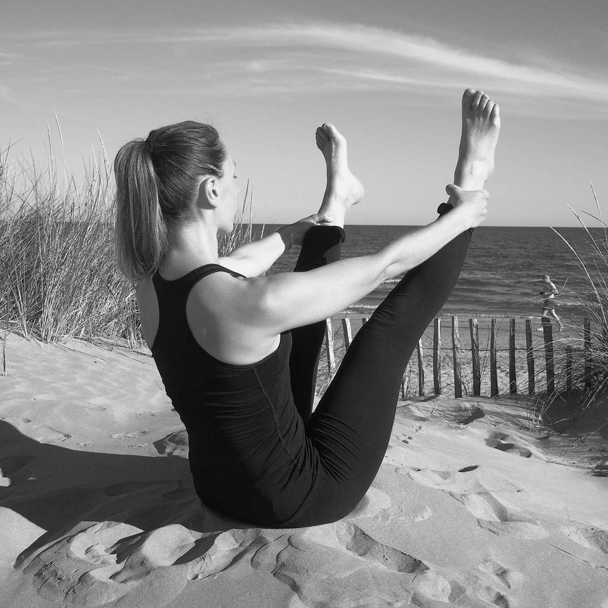

::: full

:::

# Mon approche

### Je suis arrivée au pilates par le biais de la danse classique avec ce plaisir du travail minutieux, cette recherche d'ancrage pour trouver la puissance et la liberté de mouvement. Je fais le choix de rester sur les bases fondamentales de la méthode tout en mettant les exercices en perspective des mouvements effectués dans notre vie quotidienne.

## Le respect de chaque personne avec ses particularités

A chacun son parcours, niveau, âge, profession, taille, poids, morphologie, douleurs (dos, cervicales, genoux, hanches, poignets) pathologies, etc. Je vous guide pour que vous trouviez l'équilibre entre challenge et respect de vos contraintes personnelles. Cela vous permet de **progresser en toute sécurité**.

## La qualité d'exécution des mouvements prime sur la quantité

Les exercices sont lents, précis et coordonnés avec la respiration. Cette manière de travailler permet de déprogrammer certains réflexes pour **enregistrer de nouvelles commandes musculaires**. La rapidité et la fluidité viennent avec la pratique.

## Un cours en effectif restreint et sans musique

La méthode est minutieuse et exigeante. Les conditions doivent favoriser la concentration des élèves et me permettre de faire des **corrections individuelles**.

## La synergie du corps et de l’esprit

Pendant une heure, chaque mouvement est pensé puis éxecuté du centre vers les extrémités. Le pilates se pratique nécessairement en **pleine conscience** depuis le **centre d'énergie**.

Il est malheureusement fréquent d’exécuter les exercices, qui paraissent simples, sans entrer véritablement dans la technique et de passer alors à coté de ses <a href="/bienfaits">bienfaits</a>. Ces bases sont indispensables pour pratiquer véritablement le pilates.

> Il n'y a rien de plus gratifiant que de voir un personne (re-)découvrir son corps, se déployer pendant le cours et se transformer durablement au fur et à mesure des séances.

C'est cette sensation puissamment positive que j'ai à cœur de faire découvrir aujourd'hui aux personnes qui pratiquent le pilates avec moi.

## Mes formations

J'ai commencé le Pilates en 2007 alors que je pratiquais la danse depuis de nombreuses années. Grâce à cette technique et à partir du travail du _Centre_ (le _Power House_ : plancher pelvien et sangle abdominale), j'ai gagné en tonicité, stabilité, fluidité et précision dans tous mes mouvements.

> Mon corps est devenu un allié, tant dans ma pratique sportive que dans mon quotidien.

- **Pilates** : Set Studio / Paris Pilates mat niveau 1, 2 et cours individuels
- **Sport Santé : Educateur Sportif sur Prescription Médicale** (formation en cours 2019), CROS, Île-de-France 
- **CQP ALS** : Institut des Métiers de la Forme, Paris
- **Cycle MBSR** (Mindfulness Based Stress Reduction): initiation à la pleine conscience avec Fabien Devaugermé, Centre de Pleine Conscience, Paris

Je continue à me former, explorer et m'inspirer en participant régulièrement à des cours, des ateliers et des stages (de pratique et de formation) de pilates et d'autres approches corporelles et de méditation.