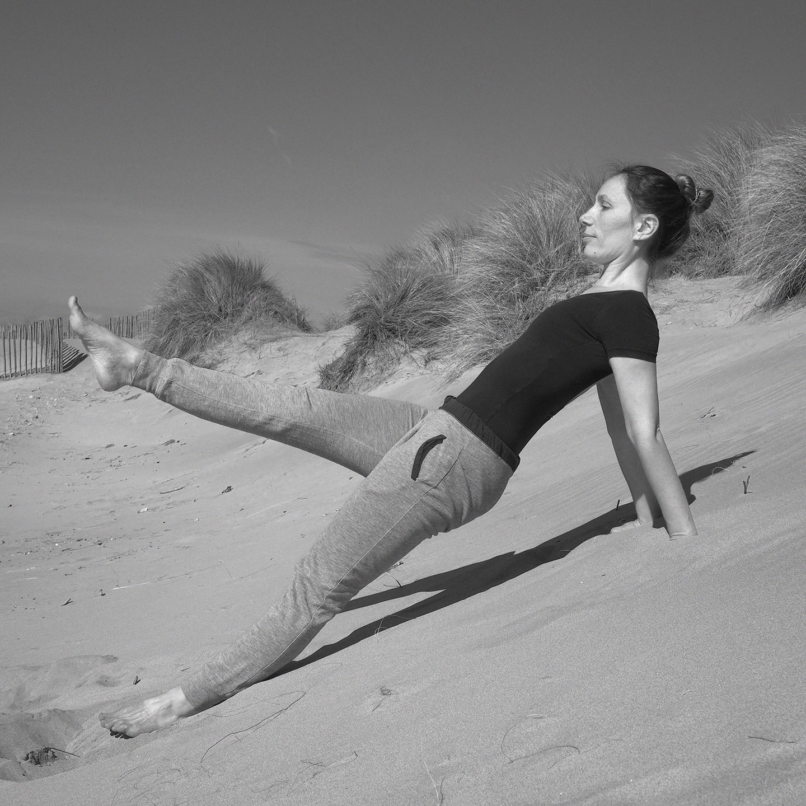

::: full

:::

# Public

### Le pilates est accessible à tous, hommes, femmes, adultes, personnes âgées,adolescents... Il est possible de commencer à tout âge, peu importe sa condition physique !

La méthode pilates repose sur 6 principes : la concentration, le centrage, la respiration, le contrôle, la précision et la fluidité.

> C'est la garantie d'un travail intense en toute sécurité qui permet de modifier certaines habitudes (posture et mouvement) pour un mieux être au quotidien.

Chaque cours comprend des échauffements, du renforcement musculaire, des étirements, un travail de respiration et de la relaxation.

Tous les execrices peuvent être adaptés, parfois à l'aide de petit matériel,afin que chacun puisse travailler à son rythme et à son niveau en fonction des ses envies et de ses capacités du moment. Les corrections individuelles permettent un travail efficace et une progression régulière.

**Le pilates est une technique d'entretien efficace, promue par de nombreuses célébrités et prisée par un public actif et  dynamique. Il est cependant particulièrement adapté aux publics spécifiques tels que:**

- Femme enceinte / post natal
- Personne âgée
- Personne en surpoids
- Personne souhaitant reprendre une activité physique
- Travailleur en posture statique (assis ou debout), personnes sédentaires
- Sportifs en quête d'amélioration de leur performance
- Musiciens, chanteurs, acteurs

**Il permet d’atteindre des objectifs divers** : bonne forme physique, tonicité, silhouette affinée, meilleur équilibre, prévention des chutes,entretien des articulations, amplitude et fluidité du mouvement, capacité de concentration, coordination, détente, performances sportives...

Le pilates peut être une activité à part entière ou être pratiqué en complément d'une autre activité physique (danse, running, natation…) ou créative (musicien, chanteur, comédien, dessinateur…).
