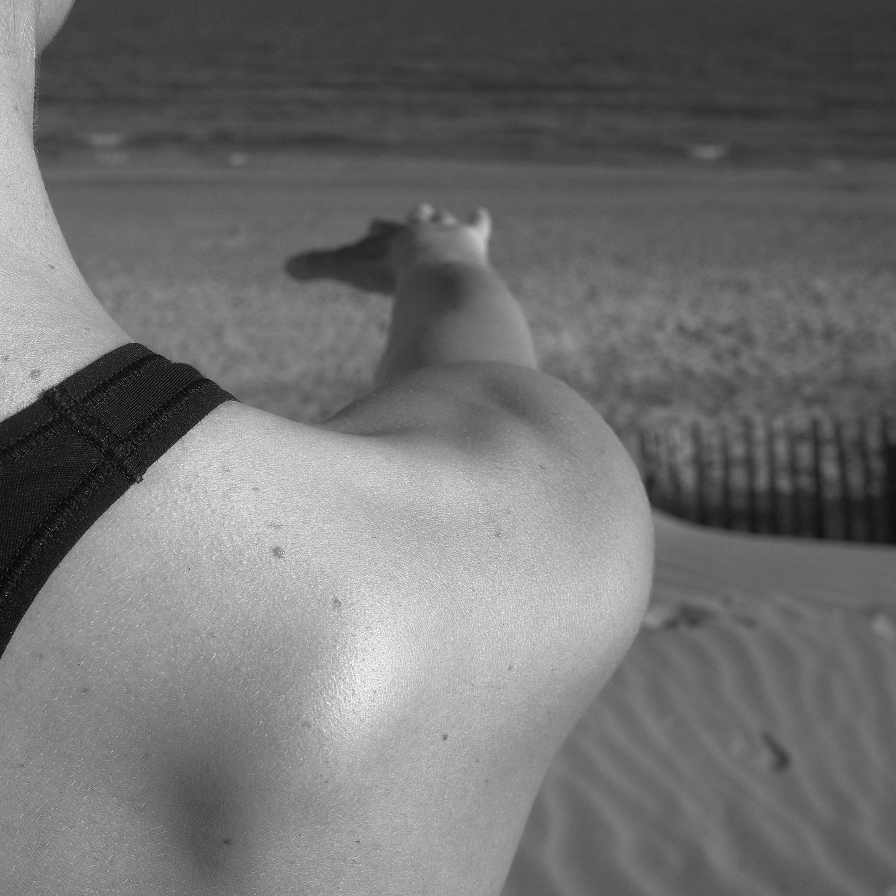

::: full

:::

# Public

### Le pilates est accessible à tous, hommes, femmes, adolescents, adultes, personnes âgées. Il est possible de commencer à tout âge, peu importe sa condition physique !

> La précision dans l'exécution des mouvements garantit un travail en toute sécurité et permet de modifier des habitudes corporelles.

Chaque cours comprend des échauffements, des étirements, du renforcement musculaire, de la respiration et de la relaxation.

Plusieurs options et adaptations sont proposées pour que chacun puisse travailler à son rythme et à son niveau en fonction des ses envies et de ses capacités du moment. Les corrections individuelles permettent un travail efficace et une progression régulière.

**Il est particulièrement adapté à :**

- Femme enceinte / post natal
- Personne âgée
- Personne en surpoids
- Personne souhaitant reprendre une activité physique
- Travailleurs en posture statique et personnes sédentaires
- Sportifs
- Musiciens

**Il permet d’atteindre des objectifs divers** : forme, tonicité, silhouette, équilibre, concentration, détente, amélioration des performances...

Le pilates peut être une activité à part entière ou en complément d'une autre activité physique (danse, running, natation…) ou créatives (musiciens, chanteurs, dessinateurs, peintres…).
